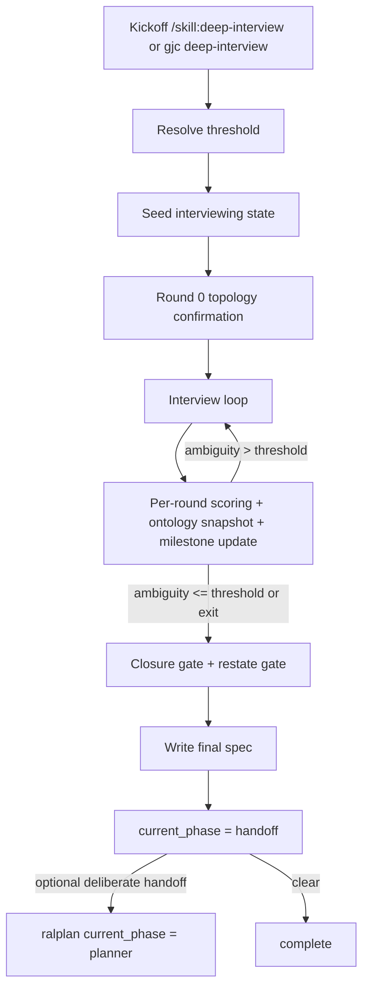

# Gajae-Code deep-interview flow survey (2026-07-06)

## Scope

Target repo: `../external_harness/gajae-code`

Goal: extract the **actual deep-interview flow** that ships in Gajae-Code, with emphasis on:
- entrypoints and state machine
- threshold resolution and ambiguity scoring
- Round 0 topology gate
- ontology snapshots and stability math
- question progression and per-round persistence
- handoff / approval behavior
- UI/runtime contracts for interactive and unattended paths

Non-goal: no pi-oven implementation here.

## Step 0.5 — tool/index availability

Observed during survey:
- `lsp status` reported `typescript-language-server (ready)` for the repo.
- `ast_grep` was available and useful for symbol discovery, but several index/generated files reported parse errors, so exact evidence below falls back to `read` once targets were known.
- No separate CRG query tool was exposed in this session, so the survey used `lsp` + `ast_grep` + `grep` + `read`.

## Concise architecture summary

Gajae deep-interview is **split cleanly between prompt-contract and runtime primitives**:

1. **Skill prose owns the interview algorithm**:
   - when to trigger deep-interview
   - Round 0 topology confirmation
   - weakest-dimension targeting
   - ambiguity formulas
   - ontology extraction/stability rules
   - milestone bands
   - lateral-review panel rules
   - spec structure and post-spec execution choices
   - source: `packages/coding-agent/src/defaults/gjc/skills/deep-interview/SKILL.md#A386`

2. **Native runtime owns durable state + handoff mechanics**:
   - CLI entrypoint: `packages/coding-agent/src/commands/deep-interview.ts#7482:4-37`
   - kickoff/spec-write implementation: `packages/coding-agent/src/gjc-runtime/deep-interview-runtime.ts#8589:601-639`, `#8589:391-599`
   - state shape + round merge semantics: `packages/coding-agent/src/gjc-runtime/deep-interview-state.ts#2F57:19-109`, `#2F57:119-324`
   - answered/scored round recorder + transition validator: `packages/coding-agent/src/gjc-runtime/deep-interview-recorder.ts#39C9:84-172`, `#39C9:183-220`
   - HUD derivation: `packages/coding-agent/src/skill-state/workflow-hud.ts#9D1E:89-192`
   - mutation guard while deep-interview is active: `packages/coding-agent/src/skill-state/deep-interview-mutation-guard.ts#0F00:16-19`, `#0F00:410-451`

3. **Question UI is dual-path**:
   - interactive `ask` path records rounds directly via structured metadata
   - unattended/RPC path opens `workflow_gate { stage:"deep-interview", kind:"question" }`
   - sources: `packages/coding-agent/src/tools/ask.ts#6E3A:56-72`, `#6E3A:477-503`, `#6E3A:564-587`, `packages/coding-agent/src/modes/shared/agent-wire/deep-interview-gate.ts#E669:21-246`

4. **Rendering is parser-driven, not state-driven**:
   - deep-interview questions/progress are recognized from formatted assistant text and re-rendered into structured TUI sections
   - source: `packages/coding-agent/src/deep-interview/render-middleware.ts#993D:59-319`

The important consequence for pi-oven: **Gajae does not implement the interview logic in the runtime.** The runtime enforces shape, persistence, gates, and handoff; the skill prose defines the flow/math/output contract.

---

## 1. Entrypoints and top-level state machine

### 1.1 User-facing / native entrypoints

Deep-interview has two visible entry surfaces:

- slash skill entrypoint documented in the system prompt and bundled defaults:
  - `packages/coding-agent/src/prompts/system/system-prompt.md#5461:23-25`
  - `packages/coding-agent/src/defaults/gjc-defaults.ts#458D:7-10,79-80`
- native CLI/runtime bridge:
  - `packages/coding-agent/src/commands/deep-interview.ts#7482:4-31`
  - `packages/coding-agent/src/gjc-runtime/deep-interview-runtime.ts#8589:601-639`

CLI flags expose the runtime surface:
- kickoff resolution flags: `--quick`, `--standard`, `--deep`
- threshold override: `--threshold`, `--threshold-source`
- session scoping: `--session-id`
- spec persistence: `--write --stage final --slug --spec`
- optional handoff: `--handoff ralplan` or `--deliberate`
- exact declaration: `packages/coding-agent/src/commands/deep-interview.ts#7482:7-25`

### 1.2 Manifested workflow state machine

The runtime state machine is explicit in the workflow manifest:

- skill: `deep-interview`
- states: `interviewing`, `handoff`, `complete`
- terminal states: `handoff`, `complete`
- transitions:
  - `interviewing -> handoff` via `write-spec`
  - `handoff -> complete` via `clear`
  - `interviewing -> complete` via `clear`
- source: `packages/coding-agent/src/gjc-runtime/workflow-manifest.ts#79DF:145-173`

### 1.3 Practical flow layered on top of the manifest

The **real** end-to-end flow is broader than the 3 manifest phases because the skill injects sub-phases inside `interviewing`:



Evidence split:
- threshold/state/spec phases in skill: `packages/coding-agent/src/defaults/gjc/skills/deep-interview/SKILL.md#A386:79-179`, `#A386:181-301`, `#A386:317-449`, `#A386:457-548`, `#A386:617-696`
- manifest transitions in runtime: `packages/coding-agent/src/gjc-runtime/workflow-manifest.ts#79DF:145-173`
- deliberate deep-interview -> ralplan state handoff in runtime: `packages/coding-agent/src/gjc-runtime/deep-interview-runtime.ts#8589:553-583`

### 1.4 Stop/crystallization guard

The runtime does not want deep-interview to “end” without an actual persisted spec/handoff. The stop hook treats the run as crystallized only if `spec_path` exists on disk.

- `deepInterviewSpecCrystallized`: `packages/coding-agent/src/hooks/skill-state.ts#66B1:518-535`
- refusal diagnostic for terminal-without-spec: `packages/coding-agent/src/hooks/skill-state.ts#66B1:537-561`

This is a strong signal that Gajae considers **spec persistence** the real completion boundary for deep-interview, not “we asked enough questions”.

---

## 2. Threshold resolution and kickoff state

### 2.1 Skill contract

The skill makes threshold resolution a **blocking Phase 0**. It requires:
- reading user + project settings
- choosing project > user > default `0.05`
- emitting the exact first line `Deep Interview threshold: <resolvedThresholdPercent> (source: <resolvedThresholdSource>)`
- carrying `threshold_source` through all later state/spec writes
- source: `packages/coding-agent/src/defaults/gjc/skills/deep-interview/SKILL.md#A386:79-100`

### 2.2 Runtime implementation

The runtime resolves threshold with slightly different precedence than the prose now claims:

1. modern YAML config: `~/.gjc/agent/config.yml` or env-rerouted equivalent
2. project JSON: `./.gjc/settings.json`
3. user JSON: `~/.gjc/settings.json`
4. resolution preset (`--quick|--standard|--deep`) if supplied
5. fallback default `0.05`

Exact implementation:
- schema default: `packages/coding-agent/src/config/settings-schema.ts#75FE:338-341`
- default + preset values: `packages/coding-agent/src/gjc-runtime/deep-interview-runtime.ts#8589:33-41`
- JSON readers: `#8589:171-194`
- modern YAML reader: `#8589:196-217`
- precedence function: `#8589:219-230`
- argument resolution / precedence comment: `#8589:336-359`

Preset thresholds are:
- quick = `0.6`
- standard = `0.5`
- deep = `0.35`
- source: `packages/coding-agent/src/gjc-runtime/deep-interview-runtime.ts#8589:35-39`

Test coverage proving the runtime behavior:
- default 0.05: `packages/coding-agent/test/gjc-runtime/deep-interview-runtime.test.ts#6681:232-244`
- project settings honored: `#6681:246-258`
- modern YAML overrides project JSON: `#6681:260-279`
- `--threshold` beats settings: `#6681:281-296`
- resolution presets map to numbers: `#6681:298-309`

### 2.3 Seeded kickoff state

Kickoff writes `.gjc/state[/sessions/<session>]/deep-interview-state.json` with:
- `active: true`
- `current_phase: "interviewing"`
- envelope-level `threshold`, `threshold_source`, `resolution`
- nested `state.initial_idea`, `state.rounds`, `state.established_facts`, `state.current_ambiguity: 1.0`
- optional duplicated `language` at top level and under `state`

Implementation:
- state path selection: `packages/coding-agent/src/gjc-runtime/deep-interview-runtime.ts#8589:92-100`
- seed payload: `#8589:470-509`
- kickoff JSON summary: `#8589:616-625`

Kickoff JSON output shape is tested exactly as:

```json
{"skill":"deep-interview","resolution":"standard","threshold":0.05,"threshold_source":"flag:explicit","idea":"clarify this idea","state_path":"/tmp/...","handoff":"/skill:deep-interview"}
```

Source: `packages/coding-agent/test/gjc-runtime/state-handoff-thrift.test.ts#5DF1:125-135`

---

## 3. Runtime state shape and resume semantics

### 3.1 Canonical envelope

The canonical persisted envelope is `DeepInterviewStateEnvelope`:
- top-level: `threshold?`, `threshold_source?`, `state?`, plus workflow envelope fields
- nested transcript/interview data under `state`
- source: `packages/coding-agent/src/gjc-runtime/deep-interview-state.ts#2F57:73-78`

### 3.2 Canonical round/fact/trigger record types

Core persisted types:
- `DeepInterviewEstablishedFact`: stable decision/fact with `id`, `statement`, `round`, optional `component`, `dimension`, `evidence`, `disputed`
- `DeepInterviewTriggerMetadata`: `kind`, `name`, `status`, `component`, `dimension`, prior/new dimension score, prior/new ambiguity, `evidence`, optional `contradictedFactId`, optional `rationale`
- `DeepInterviewRoundRecord`: durable `round_key`, optional `round_id`, `question_id`, hashes, selected/custom answers, targeted `component`/`dimension`, `ambiguity_at_ask`, lifecycle, timestamps, optional `scores`, `ambiguity`, `triggers`
- source: `packages/coding-agent/src/gjc-runtime/deep-interview-state.ts#2F57:26-71`

### 3.3 Durable round identity

Gajae uses a durable round key so ask-time and score-time updates merge into the same record:
- preferred key: `interview_id + round_id`
- fallback key: `interview_id + round + questionId`
- implementation: `packages/coding-agent/src/gjc-runtime/deep-interview-state.ts#2F57:96-109`

### 3.4 Canonical nested state fields

Legacy flattened transcript fields are hoisted under `state`:
- `rounds`
- `established_facts`
- `current_ambiguity`
- `topology`
- `ontology_snapshots`
- `auto_researched_rounds`
- `auto_answered_rounds`
- `architect_failures`
- source: `packages/coding-agent/src/gjc-runtime/deep-interview-state.ts#2F57:119-133`

Hoisted-but-legitimately-dual fields include:
- `initial_idea`, `initial_context_summary`, `codebase_context`, `challenge_modes_used`, `interview_id`, `type`, `language`, `threshold`, `threshold_source`
- source: `packages/coding-agent/src/gjc-runtime/deep-interview-state.ts#2F57:135-151`

### 3.5 Resume semantics / legacy migration

The skill explicitly defines a topology migration rule for old deep-interview sessions:
- missing topology => `status: "legacy_missing"`
- if no final `spec_path`, rerun Round 0 before next score
- if final spec exists, do not rewrite history
- source: `packages/coding-agent/src/defaults/gjc/skills/deep-interview/SKILL.md#A386:238-240`

The runtime HUD also honors `legacy_missing` specially by **omitting target/weakest chips** instead of inventing values:
- source: `packages/coding-agent/src/skill-state/workflow-hud.ts#9D1E:168-179`

### 3.6 Lossless merge rules

`mergeDeepInterviewEnvelope()` is intentionally special-case logic, not generic state merge:
- never deletes `state`
- merges `rounds` by durable key
- preserves scored lifecycle over answered lifecycle
- preserves shell hashes/text when scoring updates blank those fields
- source: `packages/coding-agent/src/gjc-runtime/deep-interview-state.ts#2F57:214-228`, `#2F57:246-324`

This is one of the more important reusable design choices for pi-oven: the runtime separates **asked shell** from **scored enrichment** and merges them losslessly.

---

## 4. Round 0 topology gate and per-component targeting

### 4.1 Topology gate is mandatory pre-score flow

Round 0 is a one-time gate before scoring:
- format:

```text
Round 0 | Topology confirmation | Ambiguity: not scored yet
```

- asks for add/remove/merge/defer confirmation
- locks `topology.status`, `confirmed_at`, `components[]`, `deferrals[]`, `last_targeted_component_id`
- source: `packages/coding-agent/src/defaults/gjc/skills/deep-interview/SKILL.md#A386:181-240`

### 4.2 Persisted topology shape

The contract shape is:
- `components[].id`
- `components[].name`
- `components[].description`
- `components[].status` (`active|deferred`)
- `components[].evidence[]`
- `components[].clarity_scores.{goal,constraints,criteria,context}`
- `components[].weakest_dimension`
- `deferrals[].component_id`
- `deferrals[].reason`
- `deferrals[].confirmed_at`
- `last_targeted_component_id`
- source: `packages/coding-agent/src/defaults/gjc/skills/deep-interview/SKILL.md#A386:203-235`

### 4.3 How later rounds use topology

Question generation must:
- pick the **lowest-scoring active component/dimension pair**
- rotate across tied weak active components
- update `topology.last_targeted_component_id`
- switch into ontology-style questions when the core noun is unstable
- source: `packages/coding-agent/src/defaults/gjc/skills/deep-interview/SKILL.md#A386:250-301`

### 4.4 Runtime exposure of topology

Runtime does not compute topology targeting itself; it **reads topology state** to derive HUD and summaries:
- compact projection summarizes active/deferred/component names: `packages/coding-agent/src/gjc-runtime/deep-interview-recorder.ts#39C9:254-279`
- HUD picks `targetComponent` from `topology.last_targeted_component_id` and weakest dimension from `components[].weakest_dimension`: `packages/coding-agent/src/skill-state/workflow-hud.ts#9D1E:126-144`, `#9D1E:168-189`

### 4.5 Key design takeaway

The topology logic is mostly **prompt-side policy**, while the runtime provides the storage slots and display surfaces. Pi-oven should mirror that split rather than burying target-rotation logic inside rendering code.

---

## 5. Ambiguity scoring model: formulas, triggers, buckets, and what runtime actually enforces

### 5.1 Scoring formula lives in SKILL.md, not in TypeScript runtime

I found **no TypeScript scorer implementation** that computes dimension scores or ambiguity from transcript text. The weighted scoring model is declared in the bundled deep-interview skill itself:

- greenfield:
  - `ambiguity = 1 - (goal × 0.40 + constraints × 0.30 + criteria × 0.30)`
- brownfield:
  - `ambiguity = 1 - (goal × 0.35 + constraints × 0.25 + criteria × 0.25 + context × 0.15)`
- source: `packages/coding-agent/src/defaults/gjc/skills/deep-interview/SKILL.md#A386:394-397`

This is the single most important portability observation: **Gajae’s ambiguity math is prompt-contract, not native runtime logic.**

### 5.2 Trigger taxonomy

Bidirectional ambiguity rises are also specified in the skill:
- A = direct contradiction
- B = internal inconsistency
- C = low-quality/evasive answer
- D = scope expansion
- mechanism A: lower the affected dimension score; let the same weighted formula raise ambiguity; no extra penalty term
- source: `packages/coding-agent/src/defaults/gjc/skills/deep-interview/SKILL.md#A386:325-339`

### 5.3 What the runtime validates

The runtime **does not score**, but it **does validate scored transitions** once a scorer result is provided:
- if a trigger is `active`, then vs the prior scored round:
  - ambiguity must rise
  - affected dimension score must not improve
- `disputed` / `unresolved` triggers are exempt only if they carry `rationale`
- implementation: `packages/coding-agent/src/gjc-runtime/deep-interview-recorder.ts#39C9:178-220`

This is the native backstop behind the skill prose’s “TRANSITION VALIDATION” rule (`SKILL.md#A386:341-343`).

### 5.4 Scored round persistence contract

The runtime expects scoring to arrive as:
- `scores: Record<string, number>`
- `ambiguity: number`
- optional `triggers: DeepInterviewTriggerMetadata[]`
- source type: `packages/coding-agent/src/gjc-runtime/deep-interview-recorder.ts#39C9:46-54`

Scoring updates enrich the same durable round record and flip lifecycle to `scored`:
- `packages/coding-agent/src/gjc-runtime/deep-interview-recorder.ts#39C9:136-172`

### 5.5 Ambiguity percentage rendering

There are **two different percentage display paths**:

1. **Round progress report / question header**
   - the skill prose says to emit human-readable `%` text directly in assistant output
   - the render middleware mostly parses that text rather than recomputing math
   - source: `packages/coding-agent/src/defaults/gjc/skills/deep-interview/SKILL.md#A386:420-444`, `packages/coding-agent/src/deep-interview/render-middleware.ts#993D:158-236`

2. **HUD chips**
   - runtime takes numeric `0..1` ambiguity and threshold and converts them with `Math.round(value * 100)`
   - source: `packages/coding-agent/src/skill-state/workflow-hud.ts#9D1E:62-65`, `#9D1E:89-102`

So Gajae’s runtime owns only **numeric-to-chip formatting**, not transcript scoring.

### 5.6 Clarity buckets / milestone bands

There are two related bucket systems in the skill:

1. **Milestone bands** used to trigger the lateral panel:
   - `initial`: `> 0.60`
   - `progress`: `0.60 ≥ a > 0.30`
   - `refined`: `0.30 ≥ a > threshold`
   - `ready`: `≤ threshold`
   - source: `packages/coding-agent/src/defaults/gjc/skills/deep-interview/SKILL.md#A386:459-468`

2. **Human interpretation table**:
   - `0.0 - 0.1` crystal clear
   - `≤ threshold` clear enough
   - above threshold with minor gaps / moderate / high / extreme ambiguity bands
   - source: `packages/coding-agent/src/defaults/gjc/skills/deep-interview/SKILL.md#A386:867-876`

Again, these are **skill-level semantics**, not runtime enums.

---

## 6. Ontology extraction and stability

### 6.1 Ontology is part of the scoring contract

The scorer prompt is required to emit an `ontology` key with entity objects:
- `name`
- `type`
- `fields[]`
- `relationships[]`
- source: `packages/coding-agent/src/defaults/gjc/skills/deep-interview/SKILL.md#A386:381-391`

### 6.2 Stability math

Ontology convergence math is explicitly defined in prose:
- Round 1: all entities are new; `stability_ratio = N/A`
- rounds 2+: compare with previous round
  - `stable_entities`: same name
  - `changed_entities`: different names, same type, and >50% field overlap
  - `new_entities`
  - `removed_entities`
  - `stability_ratio = (stable + changed) / total_entities`
- source: `packages/coding-agent/src/defaults/gjc/skills/deep-interview/SKILL.md#A386:399-414`

### 6.3 Persisted storage

The runtime’s canonical transcript state reserves `ontology_snapshots` under `state`:
- normalization field list: `packages/coding-agent/src/gjc-runtime/deep-interview-state.ts#2F57:124-133`
- initial seed initializes `ontology_snapshots: []` in the skill contract: `packages/coding-agent/src/defaults/gjc/skills/deep-interview/SKILL.md#A386:145-163`

### 6.4 Rendering contract

Completed-round output must show a one-line ontology summary:
- `**Ontology:** {entity_count} entities | Stability: {stability_ratio} | New: {new} | Changed: {changed} | Stable: {stable}`
- source: `packages/coding-agent/src/defaults/gjc/skills/deep-interview/SKILL.md#A386:431-444`

The render middleware parses this line structurally and converts `|` parts into bullet summaries:
- parser: `packages/coding-agent/src/deep-interview/render-middleware.ts#993D:191-199`
- display helper: `#993D:247-257`, `#993D:307-310`

---

## 7. Question progression, answer recording, and unattended gate contract

### 7.1 Ask-time structured metadata contract

The deep-interview-aware `ask` payload optionally carries:
- `deepInterview.round_id?`
- `deepInterview.round`
- `deepInterview.component`
- `deepInterview.dimension`
- `deepInterview.ambiguity`
- source in skill prose: `packages/coding-agent/src/defaults/gjc/skills/deep-interview/SKILL.md#A386:289-301`
- source in zod schema/runtime: `packages/coding-agent/src/tools/ask.ts#6E3A:56-72`

### 7.2 Automatic round recording from ask

If metadata is present, the ask tool records the round automatically by calling the recorder:
- `packages/coding-agent/src/tools/ask.ts#6E3A:477-503`
- callsite proven by `lsp references` and code at `packages/coding-agent/src/tools/ask.ts#6E3A:487-491`

That records an **answered shell** with:
- hashes for question/answer
- targeted component/dimension
- `ambiguity_at_ask`
- lifecycle `answered`
- implementation: `packages/coding-agent/src/gjc-runtime/deep-interview-recorder.ts#39C9:84-104`

### 7.3 Unattended / RPC gate contract

For unattended controllers, deep-interview questions become `workflow_gate` events:
- `stage: "deep-interview"`
- `kind: "question"`
- answer schema: `{ selected: string[]; other?: boolean; custom?: string }`
- option descriptions mark the recommended option
- `context.stage_state` includes `question_id`, `multi`, `options`, `other_option`
- source: `packages/coding-agent/src/modes/shared/agent-wire/deep-interview-gate.ts#E669:104-187`

### 7.4 Structured metadata beats regex parsing

If structured `deepInterview` metadata is present, it becomes authoritative `stage_state`:
- adds `deep_interview_metadata: true`
- fields: `round`, `round_id?`, `component`, `dimension`, `ambiguity`
- source: `packages/coding-agent/src/modes/shared/agent-wire/deep-interview-gate.ts#E669:147-158`

Without metadata, Gajae falls back to regex-parsing the formatted question header:
- parser: `packages/coding-agent/src/modes/shared/agent-wire/deep-interview-gate.ts#E669:80-102`
- tested behavior: `packages/coding-agent/test/deep-interview-workflow-gates.test.ts#3A0E:119-166`

This is a key runtime contract for pi-oven: **prefer structured metadata, keep human-readable header as compatibility fallback**.

### 7.5 Gate answer decoding

The gate answer decoder enforces:
- option labels must be known
- duplicate selections rejected
- single-select cannot combine multiple picks
- free-text path uses `other: true` + `custom`
- output parity with interactive path: `{ id, question, options, multi, selectedOptions, customInput }`
- source: `packages/coding-agent/src/modes/shared/agent-wire/deep-interview-gate.ts#E669:189-246`
- tested in `packages/coding-agent/test/deep-interview-workflow-gates.test.ts#3A0E:28-117`

---

## 8. Round completion output: exact structure and example mapping

### 8.1 Canonical completion template

The skill’s Round-complete output shape is exact and stable:
- header: `Round {n} complete.`
- markdown table with `Dimension | Score | Weight | Weighted | Gap`
- ambiguity row showing direction: `{prior_score}% -> {score}% {up|down|flat}`
- `**Topology:** ...`
- `**Ontology:** ...`
- `**Milestone:** ...`
- `**Next target:** ...`
- final status line:
  - `Clarity threshold met! Ready to proceed.` or
  - `Focusing next question on: {weakest_dimension}`
- source: `packages/coding-agent/src/defaults/gjc/skills/deep-interview/SKILL.md#A386:416-444`

### 8.2 Renderer/parser that recognizes this output

`parseProgress()` in the render middleware recognizes exactly those pieces:
- `Round {n} complete.` header
- table rows
- ambiguity row extracted from the `Weighted` cell
- `**Topology:**`, `**Ontology:**`, `**Next target:**`
- status line prefix match on `Clarity threshold met!` or `Focusing next question on:`
- source: `packages/coding-agent/src/deep-interview/render-middleware.ts#993D:158-219`

Then `renderModel()` turns them into structured TUI sections:
- title: `Deep Interview · Round {n} complete`
- labels: `Ambiguity`, `Clarity`, per-dimension sections, `Topology`, `Ontology`, `Next target`, `Status`, `Additional details`
- source: `packages/coding-agent/src/deep-interview/render-middleware.ts#993D:293-319`

### 8.3 Concrete example mapping

The render test provides a compact canonical sample:
- raw example: `packages/coding-agent/test/modes/components/deep-interview-render-middleware.test.ts#9796:38-64`

Raw lines from the test:

```text
Round 3 complete.
| Goal | 0.80 | 0.40 | 0.32 | Clear |
| Constraints | 0.65 | 0.30 | 0.20 | Mobile/Desktop boundaries are still unresolved |
| Success Criteria | 0.55 | 0.30 | 0.17 | Approval completion criteria are not yet testable |
| **Ambiguity** | | | **38%** | |
**Topology:** Targeted Review UI | Active: 4 | Deferred: 0 | Next rotation after: review-ui
**Ontology:** 6 entities | Stability: 75% | New: 1 | Changed: 0 | Stable: 5
**Next target:** Review UI / Success Criteria — approval criteria remain unclear
```

Field mapping:

| Raw fragment | Parsed field | Rendered label / effect | Evidence |
| --- | --- | --- | --- |
| `Round 3 complete.` | `round = "3"` | title `Deep Interview · Round 3 complete` | `render-middleware.ts#993D:158-161`, `#993D:293-296` |
| `| Goal | 0.80 | 0.40 | 0.32 | Clear |` | dimension row | `Goal` label with `Score 0.80 · weight 0.40 · weighted 0.32` + `Clear` | `render-middleware.ts#993D:175-183`, `#993D:301-304` |
| `| Constraints | ... unresolved |` | dimension row | `Constraints` label with `Gap: ...` | `render-middleware.ts#993D:175-183`, `#993D:302-304` |
| `| **Ambiguity** | | | **38%** | |` | `ambiguity = "38%"` | `Ambiguity` label | `render-middleware.ts#993D:179-181`, `#993D:297` |
| `**Topology:** ...` | `topology` | bulletized `Topology` summary | `render-middleware.ts#993D:186-189`, `#993D:247-257`, `#993D:307` |
| `**Ontology:** ...` | `ontology` | bulletized `Ontology` summary | `render-middleware.ts#993D:191-194`, `#993D:308` |
| `**Next target:** ...` | `nextTarget` | `Next target` label | `render-middleware.ts#993D:196-199`, `#993D:309` |

A second render test proves the status-line path:
- sample: `Clarity threshold met! Ready to proceed.`
- source: `packages/coding-agent/test/modes/components/deep-interview-render-middleware.test.ts#9796:66-87`
- parser/status matcher: `packages/coding-agent/src/deep-interview/render-middleware.ts#993D:201-203,309-310`

### 8.4 Important nuance: renderer parses strings, not state objects

The round-completion UI contract is **string-format-sensitive**. The TUI enhancements are driven by pattern-matching assistant text, not by directly reading the deep-interview state file.

That means pi-oven can copy this behavior only if it also preserves a stable textual grammar or introduces a stronger structured rendering channel.

---

## 9. Approval handoff and pending-approval behavior

### 9.1 Deep-interview itself does not own a formal approval gate type

I found **no `workflow_gate { stage:"deep-interview", kind:"approval" }`**. The formal approval gate implementation is for:
- `ralplan` pending approval => `kind: "approval"`
- `ultragoal` execution sign-off => `kind: "execution"`
- source: `packages/coding-agent/src/modes/shared/agent-wire/approval-gate.ts#5D46:1-152`

Deep-interview’s own user choice after spec generation is still described in skill prose as an `ask`-tool question with 4 options (`ralplan`, `ultragoal`, `team`, `refine further`), not a distinct approval-gate primitive:
- source: `packages/coding-agent/src/defaults/gjc/skills/deep-interview/SKILL.md#A386:617-640`

### 9.2 What the deep-interview runtime actually does on spec write

On `--write --stage final`, deep-interview runtime:
- writes `.gjc/specs/deep-interview-{slug}.md`
- writes spec index entry
- updates deep-interview state with:
  - `current_phase: "handoff"`
  - `spec_slug`, `spec_path`, `spec_sha256`, `spec_stage`, `spec_persisted_at`
- implementation: `packages/coding-agent/src/gjc-runtime/deep-interview-runtime.ts#8589:391-458`

The tested persisted state after plain write is:
- `current_phase === "handoff"`
- `active === true`
- source: `packages/coding-agent/test/gjc-runtime/deep-interview-runtime.test.ts#6681:113-135`

### 9.3 Deliberate handoff to ralplan

If `--deliberate` or `--handoff ralplan` is used, the runtime:
1. persists the final spec
2. seeds ralplan deliberate mode
3. performs `gjc state handoff --mode deep-interview --to ralplan`
4. returns a JSON `handoff` object with `to`, `mode`, `state_path`, `run_id`
- implementation: `packages/coding-agent/src/gjc-runtime/deep-interview-runtime.ts#8589:537-583`

Tested output shape:

```json
{
  "skill":"deep-interview",
  "stage":"final",
  "slug":"matrix",
  "path":"/tmp/...",
  "sha256":"...",
  "spec_path":"/tmp/...",
  "sha":"...",
  "created_at":"...",
  "state_path":"/tmp/...",
  "handoff":{"to":"ralplan","mode":"deliberate","state_path":"/tmp/...","run_id":"run-b"}
}
```

Source: `packages/coding-agent/test/gjc-runtime/state-handoff-thrift.test.ts#5DF1:138-153`

State consequences are also tested:
- deep-interview becomes `active:false`, `current_phase:"handoff"`, `handoff_to:"ralplan"`
- ralplan becomes `active:true`, `current_phase:"planner"`, `handoff_from:"deep-interview"`
- source: `packages/coding-agent/test/gjc-runtime/deep-interview-runtime.test.ts#6681:137-176`

### 9.4 Where “pending approval” actually lives

In Gajae, **pending approval is primarily a ralplan concept**, not a deep-interview state enum:
- `approval-gate.ts` maps ralplan final plans to `workflow_gate { kind:"approval" }`: `packages/coding-agent/src/modes/shared/agent-wire/approval-gate.ts#5D46:4-16,59-77,110-130`
- ralplan writes `pending-approval.md` on final stage: `packages/coding-agent/src/gjc-runtime/ralplan-runtime.ts#D51D:494-511`
- ralplan HUD treats `stage === "final"` or `pending_approval === true` as pending approval: `packages/coding-agent/src/gjc-runtime/state-runtime.ts#738E:915-930`

So the Gajae pipeline is best summarized as:
- deep-interview: clarify -> spec -> handoff
- ralplan: consensus refine -> **pending approval**
- execution: only after explicit approval

This matters for pi-oven because the current native deep-interview contract in this repo already carries `phase: approval_pending` / `approval handoff` metadata. That is **not** how Gajae models native deep-interview state today.

---

## 10. Mutation boundaries while deep-interview is active

Gajae enforces that deep-interview is requirements-only, not implementation mode:
- public block message: `packages/coding-agent/src/skill-state/deep-interview-mutation-guard.ts#0F00:16-19`
- active-session tool blocking logic: `#0F00:410-451`
- agent-session wraps edit/write/ast_edit/bash with this guard: grep evidence at `packages/coding-agent/src/session/agent-session.ts#F7F0:3766-3792`

Observed behavior:
- direct edits/writes/ast_edit are blocked while deep-interview is active
- `.gjc/**` state/artifact mutation is blocked except through sanctioned `gjc` workflow commands
- bash itself is not universally blocked because the workflow CLI needs it, but the mutation boundary is still enforced on target paths

This is a runtime/tooling concern, not skill prose.

---

## 11. Exact files / symbols implementing ambiguity scoring and round completion output

### 11.1 Ambiguity scoring contract

Primary sources:
- `packages/coding-agent/src/defaults/gjc/skills/deep-interview/SKILL.md#A386:317-449`
  - scoring rules
  - trigger taxonomy A/B/C/D
  - mechanism A
  - formulas
  - progress report template
- `packages/coding-agent/src/defaults/gjc/skills/deep-interview/SKILL.md#A386:457-482`
  - milestone bands and lateral panel trigger
- `packages/coding-agent/src/defaults/gjc/skills/deep-interview/SKILL.md#A386:867-876`
  - human interpretation buckets

### 11.2 Native validator / persistence for scored rounds

Symbols:
- `validateDeepInterviewScoredTransition()`
  - file: `packages/coding-agent/src/gjc-runtime/deep-interview-recorder.ts#39C9:183-220`
- `enrichRoundWithScoring()`
  - file: `packages/coding-agent/src/gjc-runtime/deep-interview-recorder.ts#39C9:136-172`
- `enrichDeepInterviewRoundScoring()`
  - file: `packages/coding-agent/src/gjc-runtime/deep-interview-recorder.ts#39C9:419-447`

### 11.3 Round completion output parser / renderer

Symbols:
- `parseProgress()`
  - file: `packages/coding-agent/src/deep-interview/render-middleware.ts#993D:158-220`
- `renderModel()` progress branch
  - file: `packages/coding-agent/src/deep-interview/render-middleware.ts#993D:293-319`
- `renderDeepInterviewAssistantText()`
  - file: `packages/coding-agent/src/deep-interview/render-middleware.ts#993D:321-325`

### 11.4 HUD completion summary

Symbols:
- `buildDeepInterviewHudSummary()`
  - file: `packages/coding-agent/src/skill-state/workflow-hud.ts#9D1E:89-103`
- `deriveDeepInterviewHud()`
  - file: `packages/coding-agent/src/skill-state/workflow-hud.ts#9D1E:152-192`

### 11.5 Ask/gate bridge that carries round metadata

Symbols:
- `DeepInterviewMeta` zod schema
  - file: `packages/coding-agent/src/tools/ask.ts#6E3A:56-72`
- `#recordDeepInterviewRound()`
  - file: `packages/coding-agent/src/tools/ask.ts#6E3A:477-503`
- `questionToGate()`
  - file: `packages/coding-agent/src/modes/shared/agent-wire/deep-interview-gate.ts#E669:160-187`
- `gateAnswerToResult()`
  - file: `packages/coding-agent/src/modes/shared/agent-wire/deep-interview-gate.ts#E669:206-246`

---

## 12. What belongs in pi-oven skill prose vs runtime/tooling

### 12.1 Belongs in skill prose (Gajae pattern)

These are algorithm/policy/text-template concerns in Gajae and should stay prompt-side if pi-oven wants the same architecture:
- when to use deep-interview vs plan vs execution
- Round 0 topology enumeration instructions
- weakest-component / weakest-dimension targeting strategy
- ambiguity formulas and weights
- trigger semantics A/B/C/D and mechanism A
- ontology extraction and stability rules
- milestone band definitions
- lateral-review panel personas and invoke conditions
- closure/restate gates
- spec markdown structure
- post-spec execution option wording

Evidence: almost all of this lives in `packages/coding-agent/src/defaults/gjc/skills/deep-interview/SKILL.md#A386`.

### 12.2 Belongs in runtime/tooling

These are clearly runtime-owned in Gajae and should not be left to skill prose alone:
- threshold config resolution and source tracking
- state-path selection and session scoping
- canonical nested deep-interview envelope
- durable round IDs / hashes / merge semantics
- automatic ask-time round recording
- transition validation for trigger-based ambiguity rises
- `workflow_gate` schema for unattended question answering
- HUD derivation from persisted state
- text renderer/parser for deep-interview-specific assistant output
- mutation guard while deep-interview is active
- state handoff to ralplan and safe spec persistence

Evidence: `deep-interview-runtime.ts`, `deep-interview-state.ts`, `deep-interview-recorder.ts`, `deep-interview-gate.ts`, `workflow-hud.ts`, `deep-interview-mutation-guard.ts`.

### 12.3 Boundary that pi-oven should copy exactly

The strongest reusable Gajae boundary is:

> **Skill defines the semantics; runtime stores/validates/bridges them.**

In particular, the runtime validates scored transitions but does **not** attempt to reproduce the scoring prompt’s full reasoning engine.

---

## 13. Migration checklist for pi-oven brainstorming / deep-interview redesign

### A. State machine and approval model

- [ ] Decide whether pi-oven should copy Gajae’s native phases exactly: `interviewing -> handoff -> complete` (`packages/coding-agent/src/gjc-runtime/workflow-manifest.ts#79DF:145-173`) or keep the current pi-oven-native `approval_pending` phase.
- [ ] If mirroring Gajae, move “pending approval” ownership out of deep-interview runtime and into post-spec ask flow / ralplan approval flow.
- [ ] If keeping pi-oven’s current `approval_pending`, document that as an intentional divergence from Gajae, not a supposed port.

### B. Skill-prose port

- [ ] Port Round 0 topology confirmation before any ambiguity scoring (`SKILL.md#A386:181-240`).
- [ ] Port weakest-component / weakest-dimension targeting and rotation (`SKILL.md#A386:262-270`).
- [ ] Port greenfield/brownfield weighted formulas exactly if desired (`SKILL.md#A386:394-397`).
- [ ] Port trigger taxonomy A/B/C/D and mechanism A (`SKILL.md#A386:327-343`).
- [ ] Port ontology extraction + stability rules if pi-oven wants topology/ontology parity (`SKILL.md#A386:381-414`).
- [ ] Port milestone bands and lateral panel rules if brainstorming should escalate on ambiguity transitions (`SKILL.md#A386:457-482`).
- [ ] Port closure audit + restate gate if the redesign wants “math says ready” to still require human-confirmed semantic alignment (`SKILL.md#A386:486-496`).

### C. Runtime/tooling port

- [ ] Add a native deep-interview envelope shape with nested `state`, not flat ad hoc fields (`deep-interview-state.ts#2F57:119-177`).
- [ ] Add durable round keys and two-phase round lifecycle (`answered` then `scored`) (`deep-interview-state.ts#2F57:96-109`, `deep-interview-recorder.ts#39C9:84-172`).
- [ ] Add structured `deepInterview` metadata to `pi-oven_ask` payloads so rounds can be recorded without brittle regex parsing (`ask.ts#6E3A:56-72`, `deep-interview-gate.ts#E669:147-187`).
- [ ] Keep a regex fallback only for backward compatibility, not as the primary transport (`deep-interview-gate.ts#E669:80-102`).
- [ ] Add a runtime validator equivalent to `validateDeepInterviewScoredTransition()` so contradiction-triggered “improvements” cannot be persisted silently (`deep-interview-recorder.ts#39C9:183-220`).
- [ ] Add HUD derivation from persisted state rather than recomputing from current prompt text (`workflow-hud.ts#9D1E:152-192`).
- [ ] Add mutation/tool guard behavior if brainstorming/deep-interview must be non-mutating (`deep-interview-mutation-guard.ts#0F00:16-19`, `#0F00:410-451`).

### D. Output/rendering contract

- [ ] Decide whether pi-oven wants Gajae-style text-first rendering (`Round n complete` markdown grammar parsed back into structured UI) or a more strongly structured native render contract.
- [ ] If copying Gajae text-first UX, preserve the exact round-question / topology / round-complete header grammar because the renderer depends on it (`render-middleware.ts#993D:59-236`).
- [ ] Add example-based tests for at least one completed round block with topology, ontology, next target, and threshold-met status (`deep-interview-render-middleware.test.ts#9796:38-87`).

### E. Approval / handoff tooling

- [ ] Decide whether pi-oven needs a dedicated deep-interview approval gate type. Gajae does **not** have one; only ralplan/ultragoal do (`approval-gate.ts#5D46:1-152`).
- [ ] If pi-oven wants post-spec choice UI, keep it as an ask-level decision or explicitly add a new native gate contract instead of smuggling it into prose.
- [ ] Add explicit spec-write + handoff receipts if the redesign wants safe resumability and transport-friendly summaries (`deep-interview-runtime.ts#8589:537-599`, `state-handoff-thrift.test.ts#5DF1:138-171`).

---

## Bottom line

The Gajae implementation is **not** “one deep-interview module.” It is a layered system:

- the **skill** defines the Socratic algorithm, formulas, topology/ontology semantics, and output grammar;
- the **runtime** provides canonical state, round recording, transition validation, handoff, and HUD/render contracts;
- the **ask/workflow-gate bridge** is the critical glue that turns one-question-at-a-time interviewing into durable resumable state.

If pi-oven wants to follow this flow faithfully, the most important port is **not** the markdown prose by itself. It is the combination of:
1. Round 0 topology state,
2. structured ask metadata,
3. answered->scored round enrichment,
4. runtime validation of contradiction-triggered ambiguity rises,
5. a clear decision about whether approval belongs inside deep-interview state or after handoff.